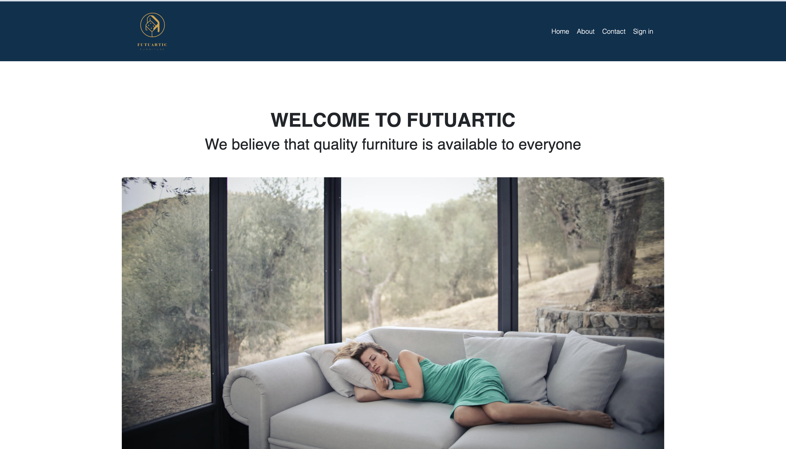
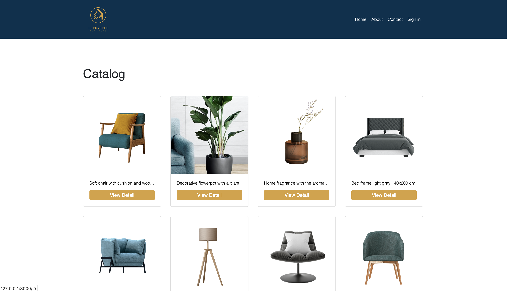
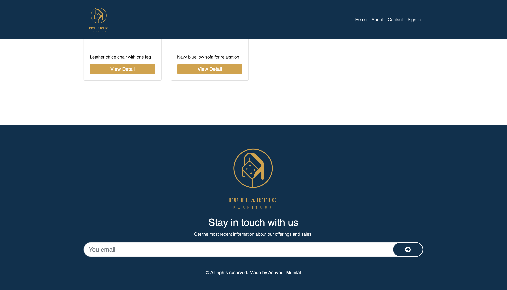
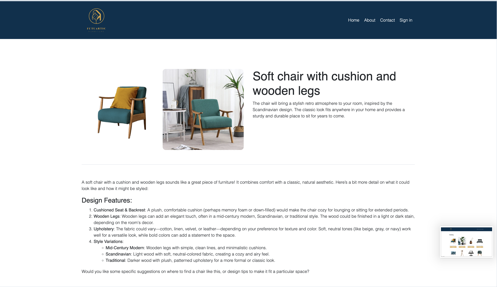
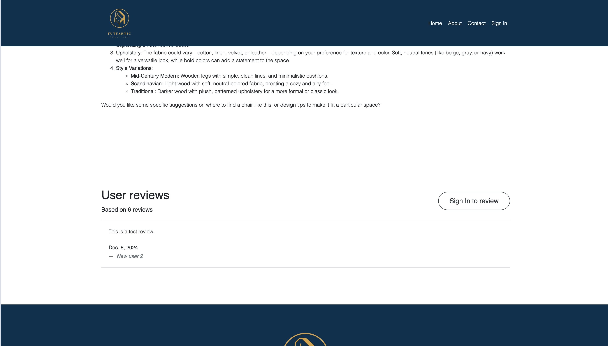
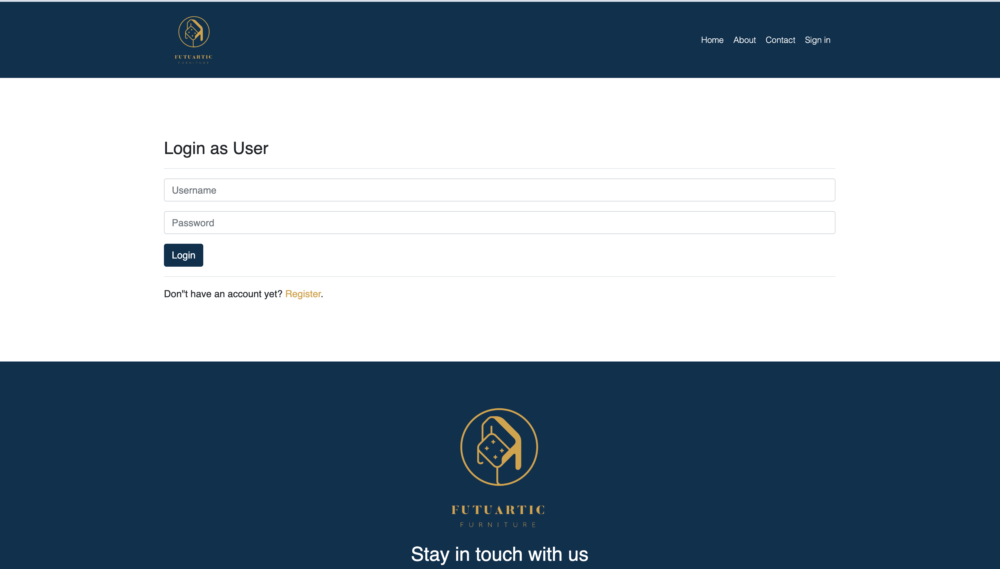
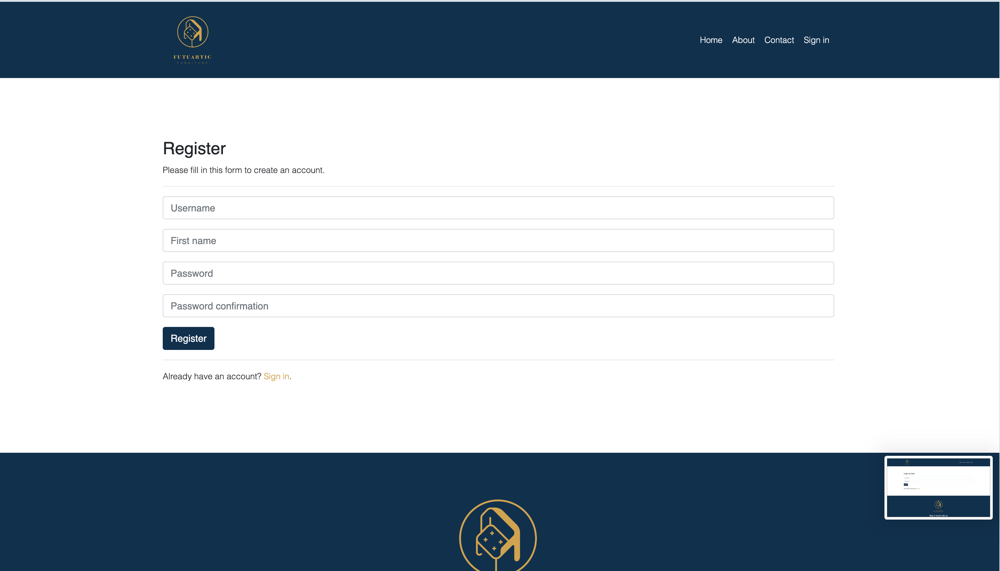

# My Site

A straightforward website for a fake brand that lets users browse and comment on catalog items while administrators add database-driven items.

**Table of Contents**

- [Prerequisites](#prerequisites)
- [Installation](#installation)
- [Usage](#usage)
- [Features](#features)
- [Author](#author)
- [License](#license)

## Prerequisites

Before setting up the project, make sure you have the following tools installed:

- Python 3.x (3.8 or above recommended)
- pip
- Virtualenv (optional, but recommended)

For development, you can use Docker, if available.

## Installation

1. Clone the repository 
```sh 
git clone git@github.com:amunilal/mySite.git
cd mySite
```
2. Set up a virtual environment (optional but recommended)
```sh 
python3 -m venv venv
source venv/bin/activate  # On Windows, use `venv\Scripts\activate`
```
3. Install dependencies
```sh 
pip install -r requirements.txt
```
This will install all the necessary packages listed in the requirements.txt file.

## Usage

1. Run migrations to set up your database schema:
```sh 
python manage.py migrate
```
2. Create a superuser to access the admin interface (optional but recommended):
```sh 
python manage.py createsuperuser
```
3. Generate new `SECRET_KEY` for django project
```sh
python -c 'from django.core.management.utils import get_random_secret_key; print(get_random_secret_key())'
```
4. Add environment variables
```sh
echo "DJANGO_SECRET_KEY=YOUR_SECRET_KEY
DEBUG=False
DJANGO_ALLOWED_HOSTS=*" > .env
```
3.Run the development server:
```sh 
python manage.py runserver
```
This will start the Django development server at http://127.0.0.1:8000/. You can access the project in your web browser.









## Features

- User login and authentication.
- Comments section
- Database driven catalogue


## Author

Ashveer Munilal – [@AuthorLinkedIn](https://www.linkedin.com/in/cgroom/) – amunilal@gmail.com


## License
This project is licensed under the MIT License - see the LICENSE file for details.


